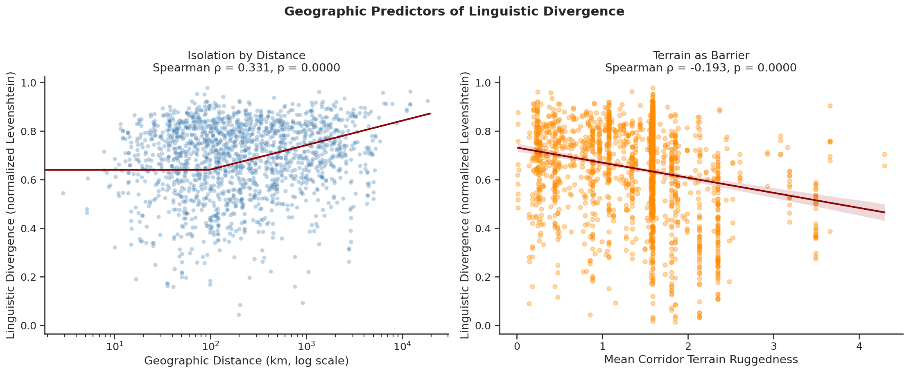
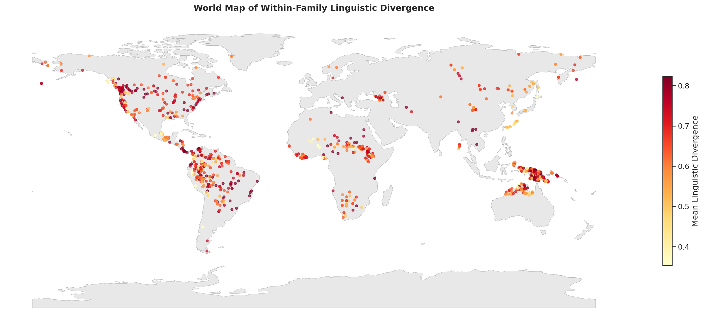
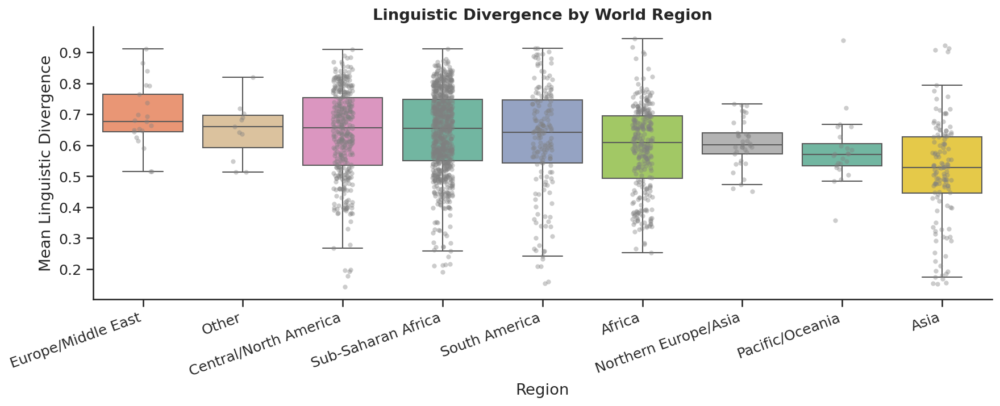

# Does Geography Shape Language?
### A Pairwise Analysis of Linguistic Divergence Across Language Families

**CS210 — Data Science Project**

[](https://colab.research.google.com/github/antistrange05/cs210/blob/main/linguistics.ipynb)
[](https://antistrange05-cs210-app-livadq.streamlit.app)

> *Do geographically separated languages diverge more from each other lexically and does terrain ruggedness between them amplify that effect beyond raw distance alone?*

---

## Overview

My project investigates the relationship between geographic isolation and lexical divergence across the world's language families. The key methodological insight is to work at the pairwise level wherein I treat every pair of related languages as an independent observation rather than averaging across entire families, which loses all within-family variation.

For each of 15,183 language pairs we compute:
- Linguistic divergence — normalized Levenshtein distance across shared ASJP vocabulary
- Geographic distance — great-circle distance in km between the two language homelands (haversine)
- Corridor terrain ruggedness — mean ruggedness index sampled along the path between the two languages

---

## Live App

**[Launch LinguaGeo](https://antistrange05-cs210-app-livadq.streamlit.app)**

Four interactive tabs:
- **Predict Divergence** — enter any two coordinates, get a predicted divergence score anchored to the 5 most similar real pairs from the dataset
- **Explore Pairs** — filter all 15,183 pairs by family, region, distance, and divergence, click any row to map its corridor
- **Key Findings** — statistical results, finding writeups, and live regression plots from the loaded data
- **Family Deep Dive** — pick any language family and see how it sits relative to the global dataset

---

## Key Findings

### 1. Isolation by Distance is Real

Geographic distance between language homelands is a significant predictor of lexical divergence:

| Test | Statistic | p-value |
|------|-----------|---------|
| Spearman ρ | **0.331** | < 0.001 *** |
| Mantel r | **0.331** | 0.001 ** |
| OLS coefficient (log dist) | **0.0418** | < 0.001 *** |

Languages farther apart diverge more — consistent with the **isolation-by-distance** model from population genetics, now confirmed for lexical divergence.

### 2. The Terrain Paradox

Counter-intuitively, terrain ruggedness is negatively associated with divergence:

| Test | Statistic | p-value |
|------|-----------|---------|
| Spearman ρ | **−0.193** | < 0.001 *** |
| OLS coefficient | **−0.0253** | < 0.001 *** |

Languages separated by rougher terrain tend to be more similar, not less. Possible explanations include:
- Mountainous regions may preserve archaic vocabulary by limiting outside contact
- Rugged homelands may host geographically proximate pairs with less time to drift

### 3. Geography Explains 26.6% of Variance

```
Divergence = 0.4841 + 0.0418 × log(distance_km) − 0.0253 × ruggedness
R² = 0.266    F = 2755    p < 0.001    n = 15,183 pairs
```

This is a dramatic improvement over the original family-level analysis (where our R² = 0.002), which demonstrates that pairwise methodology brings to light what was invisible at the aggregate level.

### 4. Regional Variation

Europe/Middle East shows the highest within-family divergence; Asia and Pacific/Oceania the lowest — likely reflecting the longer time depth of Indo-European (~6,000 years) versus more recent expansions in East Asia and Oceania.

---

## Visualizations

### Geographic Predictors of Linguistic Divergence


### World Map of Within-Family Linguistic Divergence


### Divergence by World Region


### Predictive Model — Actual vs Predicted


---

## Datasets

| Dataset | Source | Used For |
|---------|--------|----------|
| ASJP (lexibank-asjp) | [lexibank.clld.org](https://lexibank.clld.org) | Vocabulary forms in standardized transcription across world languages |
| Glottolog | [glottolog.org](https://glottolog.org) | Geographic coordinates and family classification |
| Nunn & Puga Ruggedness Index | [diegopuga.org/data/rugged](https://diegopuga.org/data/rugged/) | Terrain ruggedness per geographic grid cell |

> **Note:** `forms.csv` (51.8 MB) is tracked with Git LFS. All other files are committed directly. Clone the repo normally — Git LFS handles the large file automatically.

---

## Project Structure

```
cs210/
├── linguistics.ipynb          ← Main analysis notebook (run with outputs)
├── app.py                     ← Streamlit interactive app
├── requirements.txt           ← Python dependencies
├── README.md
│
├── Datasets/
│   ├── languoid.csv           ← Glottolog language data
│   ├── languages.csv          ← ASJP language metadata
│   ├── forms.csv              ← ASJP vocabulary forms (Git LFS)
│   ├── rugged_data.csv        ← Terrain ruggedness grid
│   └── pairs.csv              ← Precomputed pairwise dataset (15,183 rows)
│
├── predictors_plot.png
├── world_map_divergence.png
├── divergence_by_region.png
└── predictive_model.png
```

---

## Running the Notebook

### Google Colab (recommended)
Click the **Open in Colab** badge above. The first cell automatically clones the repo and sets all paths — just run all cells.

### Locally
```bash
git clone https://github.com/antistrange05/cs210.git
cd cs210
pip install -r requirements.txt
jupyter notebook linguistics.ipynb
```

---

## Running the App

### Streamlit Cloud
The app is deployed at **[antistrange05-cs210-app-livadq.streamlit.app](https://antistrange05-cs210-app-livadq.streamlit.app)** — no setup required.

### Locally
```bash
pip install -r requirements.txt
streamlit run app.py
```

---

## Methodology

### Why Pairwise?

The initial analysis averaged divergence across entire language families, yielding R² = 0.002 and no significant correlations. Averaging masks within-family variation — a family with languages ranging from 0.2 to 0.9 divergence collapses to a single number. The pairwise approach treats every pair of related languages as an observation, giving 15,183 data points and a much more precise test.

### Linguistic Divergence

Vocabulary is compared using **normalized Levenshtein distance** across shared ASJP concepts. For each pair, we find all word slots present in both languages, compute edit distance between the forms, normalize by the longer word's length, and average across all shared concepts.

### Corridor Ruggedness

Rather than using homeland centroid ruggedness, we sample ruggedness at five points **along the path between each language pair**. This captures how much of a barrier the terrain actually forms between two populations — a significant methodological improvement over the original approach.

### Statistical Tests

Three complementary approaches:
- **Spearman correlation** — non-parametric, robust to outliers
- **Multiple regression (OLS)** — tests each predictor while controlling for the other
- **Mantel test** — specifically designed for distance-matrix data, accounting for the non-independence of pairwise observations

---

## Limitations & Future Work

1. **No time depth control** — families diverging for 5,000 years naturally differ more than those diverging for 500, independent of geography. Future work could incorporate Glottolog time depth estimates as a covariate.
2. **Family fixed effects** — pairs within the same family are not fully independent. A multilevel model with family as a random effect would be more rigorous.
3. **Straight-line corridors** — ruggedness is sampled along straight paths, not actual travel routes. Least-cost path routing would be more realistic.
4. **ASJP transcription** — uses simplified phonological transcription; distances may not capture all dimensions of lexical divergence.

**Future development:** Add time depth as a control variable · Least-cost path corridor routing · Test whether the effect is stronger in specific mountain regions (Caucasus, Papua New Guinea) · Compare results across families with known geographic histories.

---

## Dependencies

```
pandas numpy scipy matplotlib seaborn geopandas geodatasets
shapely Levenshtein statsmodels scikit-learn streamlit
```

```bash
pip install -r requirements.txt
```

How to run - Navigate to linguistics.ipynb and hit the Colab button on the top left hand corner, everything is laid out there!
Also, my streamlit app is linked at the top of this page to run my app.py
This readme and my linguistic_geography.ipynb contain information about this project, and I consider a combination of the two a final report


